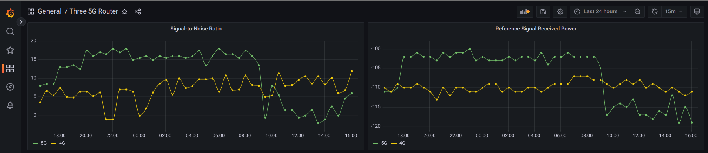

# ZTE-MC801A to InfluxDB V2

In the file `zte2influxdbv2.py` add the IP-Address and password of the ZTE-MC801A router.

`zteInstance = zteRouter("router-ip-address", "router-password")`

In the file `config.toml` configure the URL, token and organisation for the InfluxDB V2 instance.

## Output

In the file `zte2influxdbv2.py` uncumment the line `print (json.dumps(data))` and run `python zte2influxdbv2.py | jq`.

Example output:

```json
{
  "wa_inner_version": "BD_UKH3GMC801AV1.0.0B12",
  "network_type": "ENDC",
  "rmcc": 234,
  "rmnc": 20,
  "lte_rsrq": -12,
  "lte_rssi": -82,
  "lte_rsrp": -111,
  "lte_snr": 6.2,
  "Z5g_rsrp": -110,
  "Z5g_SINR": 9,
  "nr5g_action_band": "n78",
  "nr5g_action_channel": 640578,
  "ngbr_cell_info": "97,181,-12,-111,-83;98,184,-16,-115,-91",
  "pm_sensor_mdm": 41,
  "pm_modem_5g": 38,
  "wan_active_band": "LTE BAND 1",
  "wan_active_channel": 99,
  "wan_ipaddr": "66.666.666.66",
  "wan_apn": "skynet",
  "opms_wan_mode": "LTE_BRIDGE",
  "opms_wan_auto_mode": "AUTO_LTE_GATEWAY",
  "monthly_rx_bytes": 140383434072,
  "monthly_tx_bytes": 10868585852,
  "ppp_status": "ppp_connected",
  "loginfo": "ok"
}
```

## Next Steps

For example, schedule the run of the `zte2influxdbv2.py` file every 30 min in a cron job.

Then use InfluxDB as a Grafana datasource and create a dashboard e.g.



## Acknowledgements

Thanks to <https://github.com/Kajkac/ZTE-MC801A-Home-assistant> as I used `zte_tool.py` as the basis.
